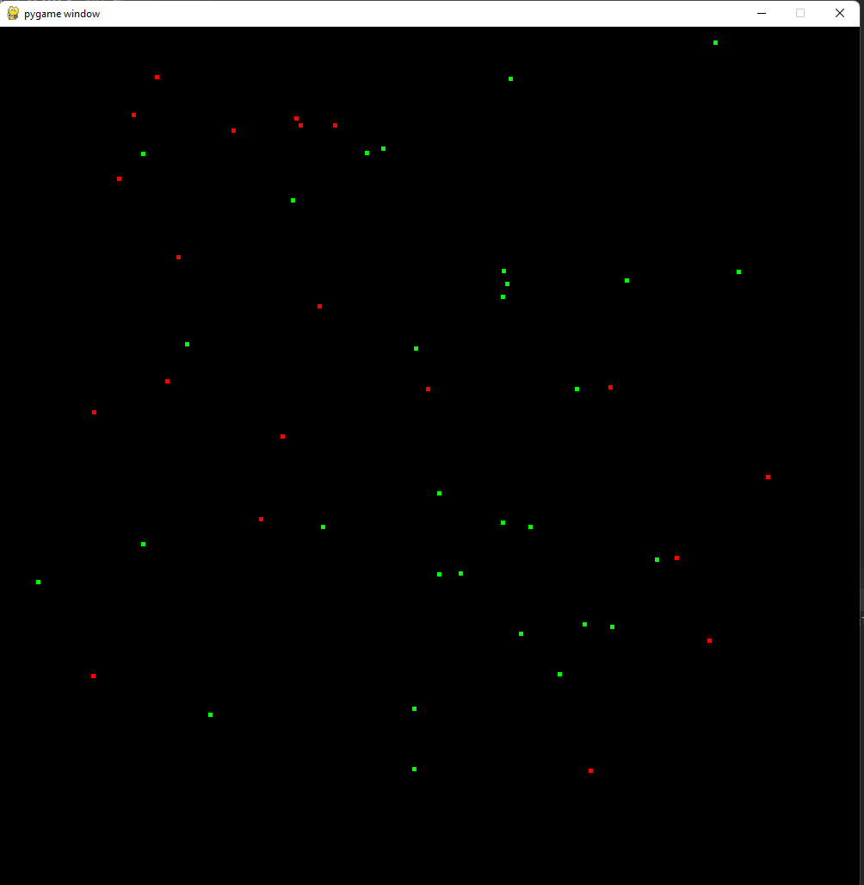

# Inheritance
The best way I can think of to showcase OOP is videogames! For this example we'll utilize
PyGame to create something extremely simple!



```bash
pip install pygame
```

## Config
We need to define some basic values for our simple game. Lets start by creating a new python file 
`config.py`

In our game we need to define some colors, target frames-per-second, and our window size!

```python
COLORS = {
    "red": (255,0,0),
    "green": (0,255,0)
}

FPS = 60
WINDOW_WIDTH = 1000
WINDOW_HEIGHT = 1000
```

If you noticed, our config variable names are all upper-case. This is to help differentiate them from
typical variables.

## Folder Structure
It's good-practice to organize your programs! As a beginner you fall into the trap of putting
everything into a single file. Eventually, it becomes difficult to maintain and debug.

Lets create the following project structure (don't worry about the contents of each file yet)
```
project
│   config.py
│   game.py    
└─── world
│   │   __init__.py
│   │   archer.py
│   │   knight.py
│   │   interfaces.py
│   │   worldobject.py
```

The `__init__.py` file is going to remain empty. Just needed to create a `python module`.

## worldobject.py
This shall contain the basic building block for things in our game! If we break down what a 
game engine needs

- Need a position to render object at
- Need a color/texture/shape to draw
- Should have a `draw` or `render` method which allows each object to support unique rendering
- Should have a `update` or `on_tick` method to support custom logic to run per-frame.

Considering this object is the foundation in which we'll build our game on... this needs to be abstract.

To support abstraction we'll utilize the `abc` module. The `abstractmethod` will force us, as the developer
to implement whichever method(s) with this decorator.

Worth noting that class names **always** start with a capital letter
```python
from abc import ABC, abstractmethod

class WorldObject(ABC):
    def __init__(self):
        pass
```

Since this is our base object... we'll want to pass in and store an x and y coordinate, color and size.
So lets refactor our `__init__` aka the `constructor` method. (I don't care what pythoneers call it... if you use any other language this is a constructor)


Our position will be required arguments.

PyGame uses a tuple for RGB values. Our default value will be white

Our size will default to 5 pixels by 5 pixels

```python
def __init__(self, x: int, y: int, color: tuple = (255,255,255), size: tuple = (5,5)):
    self._x = x
    self._y = y
    self._color = color
    self._size = size
```

We need to turn each of these variables into properties. This will help us later down the road.

```python
@property
def color(self):
    return self._color

@property
def x(self):
    return self._x

@property
def y(self):
    return self._y

@property
def size(self) -> tuple:
    return self._size
```

Alright, time to add that `on_tick` method which will allow us to define custom behaviors!
```python
@abstractmethod
def on_tick(self):
    pass
```

We also need a way to render these objects! By default we can draw a rectangle. If a certain
child class wants to customize it they can override this method!

We'll want to add an import for `import pygame.draw`. This will allow us to retrieve the current screen information
for rendering.

```python
def draw(self):
    width, height = self.size
    pygame.draw.rect(pygame.display.get_surface(), self.color, (self.x, self.y, width, height))
```

That's it! Not much going on right now, I know, but lets create a simple character so we can showcase our progress!

## archer.py

We'll create an archer which shall be represented by a green square!

First lets import our `WorldObject` class!

```python
# since worldobject is in the same folder as this... 
from .worldobject import WorldObject

# we want to import the COLORS config
# we need to reference our root project folder name
# for this project the path is OOP/OOP_01 so that translates to
from OOP.OOP_01.config import COLORS
```

To create a class which inherits, or `derives` from `WorldObject` we do

```python
class Archer(WorldObject):
```

Now we have to implement / create a constructor for our `Archer` class. This is
required since `WorldObject` has a constructor which requires a few parameters.

```python
def __init__(self, x: int, y: int):
    # can specify the parent class itself like this
    WorldObject.__init__(self, x=x, y=y, color=COLORS["green"])

    # we can alternatively do this since we only have 1 parent class!
    super().__init__(self, x=x, y=y, color=COLORS["green"])
```

This is still not enough. If we try running the program it'll complain because we haven't 
overriden the `on_tick` method from `WorldObject`!

```python
def on_tick(self):
    pass
```

For now we aren't going to do anything... this gets rid of the error though.

## game.py
This shall be the main file for our application. Lets get pygame setup.

```python
import random
import pygame
import config

# folder.filename import ClassFromFileName
from world.archer import Archer

if __name__ == "__main__":
    # initialize our pygame
    pygame.init()
    
    # set the window size for our game
    SCREEN = pygame.display.set_mode((config.WINDOW_WIDTH, config.WINDOW_HEIGHT))
    
    # initialize the display window
    pygame.display.init()
    
    # this will contain all of our objects in the game. 
    # you'll see why this is fun later
    objects = []
    
    # this will help us maintain a targeted framerate. OTHERWISE
    # the game will run as FAST as your computer can manage.
    clock = pygame.tick.Clock()
```

So lets create a random amount of Archers at random positions!
```python
archer_count = random.randint(10,50)
for i in range(0, archer_count):
    x, y = (random.randint(10, config.WINDOW_WIDTH - 100), random.randint(10, config.WINDOW_HEIGHT - 100))    
    objects.append(Archer(x,y))
```

Lets create our game loop

```python
while True:
    for event in pygame.event.get():
        if event.type == pygame.QUIT:
            break
    pygame.display.update()
    SCREEN.fill((0,0,0,))
    
    # this forces our loop to run at our targeted frame rate
    rate = clock.tick(config.FPS)
    
    """
    Because our base class WorldObject has 2 basic method
    this simplifies our game loop by A LOT
    """
    for world_object in objects:
        world_object.draw()
        world_object.on_tick()
```

## interfaces.py

Things we'll need later. Remember, this is based on the folder structure of this repository.
So you'll need to adjust based on your folder structure. 

```python
import random
from OOP.OOP_01.world.worldobject import WorldObject
from OOP.OOP_01.config import WINDOW_HEIGHT, WINDOW_WIDTH
```

Lets go down multi-inheritance! Lets say we want to create something that can be damagable (has health).
This requires having the ability to take damage and heal. At the same time we may want something that can move
around! This doesn't necessarily mean it should be damagable. By separating functionalities 
into two classes we can use multi-inheritance to pick and choose features.

A damagable object requires some health... so we'll specify an argument for it.
```python
class Damagable:
    def __init__(self, health: int):
        self._health = health
        self._max_health = health
```

Just like `WorldObject` we'll define some properties for `health` and create the appropriate methods
for `heal` and `take_damage`. We want to make sure that when healing we don't execeed
the max health value! That'd be... cheatingggggg

```python
@property
def health(self):
    return self._Health

@property
def is_alive(self):
    return self._health > 0

def heal(self, amount: int):
    """
    Increase health by `amount`
    :param amount:
    """
    self._health += abs(amount)
    if self.health > self._max_health:
        self._health = self._max_health

def take_damage(self, amount):
    """
    Reduce health by `amount`
    :param amount:
    """
    self._health -= abs(amount)
```

Now we can move onto our `Moveable` interface. To move we need some sort of speed right? We'll
have this as an argument... Additionally we need some methods to help us move this object around.

To move, we need to know our position in the world! This means our `Moveable` feature must inheirt
from `WorldObject`!

```python
class Moveable(WorldObject):
    def __init__(self, speed: float = 1):
        self._speed = speed
        self._random_dir = 0
    
    @property
    def speed(self):
        return self._speed
    
    def random_move(self):
        # we have 4 random directions
        self._random_dir = random.randint(0,3)

        if self._random_dir == 0:
            self.move_north()
        elif self._random_dir == 1:
            self.move_east()
        elif self._random_dir == 2:
            self.move_south()
        else:
            self.move_west()

    
    def move_north(self):
        self._y += self.speed
        if self._y > WINDOW_HEIGHT:
            self._y = 0
    
    def move_south(self):
        self._y -= self.speed
        if self._y < 0:
            self._y = WINDOW_HEIGHT
    
    def move_east(self):
        self._x += self.speed
        if self._x > WINDOW_WIDTH:
            self._x = 0
    
    def move_west(self):
        self._x -= self.speed
        if self._x < 0:
            self._x = WINDOW_WIDTH
```

## archer.py
We're going to revist our archer and turn it into something that can be damagable, and something
that can move! All through multi-inheritance!

```python

# we'll use both interfaces
from .interfaces import Damagable, Moveable

# we'll still need a reference to world object as you'll see later
from .worldobject import WorldObject

# color from config shall be used
from OOP.OOP_01.config import COLORS

# To inherit from more than 1 thing we simply comma separate!!!!
# TOOOoooooo easy
class Archer(Damagable, Moveable):
    def __init__(self, x: int, y: int):
        # this is where things change. We can't simply
        # use the `super()` function here like before!
        # have THREE classes. (Because movable inherits from WorldObject)
        # that we need to pass values to
        # ParentClassname.__init__(self, args go here)
        WorldObject.__init__(self, x=x, y=y, color=COLORS["green"])
        Moveable.__init__(self, speed=1.5)
        Damagable.__init__(self, health=50)
    
    # we will just randomly move around for now    
    def on_tick(self):
        self.random_move()
```

Re-run the application and you'll notice the green squares are MOVINGGGGG!!!!!

Now... try and create the `Knight` on your own! Knights can be represented by the color `red`!
