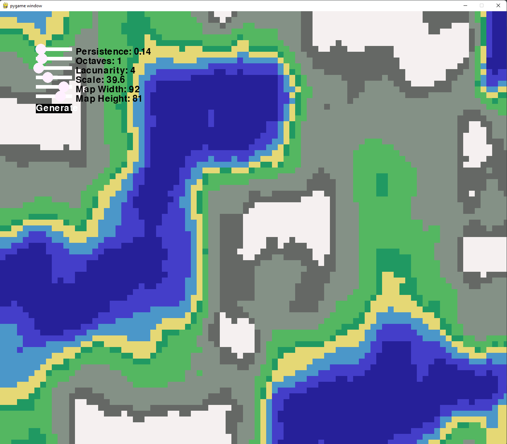

# Overview

We'll use some OOP concepts to help us build a simple map generator in pygame!

Of course, there are a few bugs with the UI regarding circle position not matching the
default value. But that's not the purpose of this. You're welcome to address it if you want.

---
[Next Section](pre_req.md)